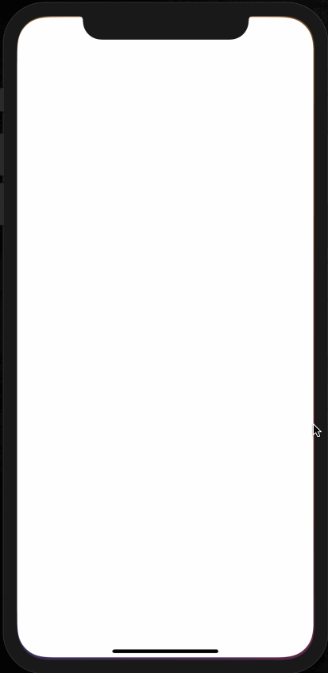
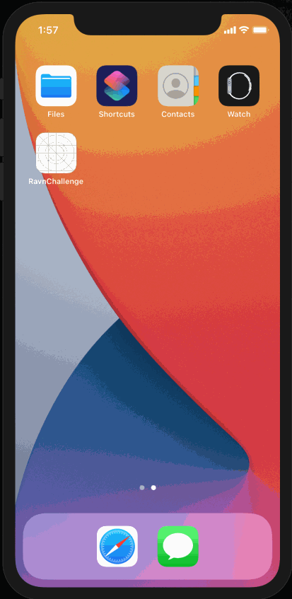

# Ravn-Challenge-V2-Samuel-Cornejo
Samuel Cornejo's Ravn Challenge

## Description
This is Samuel Cornejo's code challenge for Ravn's iOS Engineer position. 

The app was built using **SwiftUI 2.0** and **Swift 5.3**. In order to run this on a phone, it has to be upgraded to at least **iOS 14.0**.

## Setup
### Requirements
* You must use Xcode 12.0 or superior
* In order to run the project on a real device, it must be upgraded to at least **iOS 14.0**

### Running Instructions
1. Download the project
2. Navigate the folders until finding **RavnChallenge.xcodeproj**
3. Double click **RavnChallenge.xcodeproj** (or if done by terminal, type `open RavnChallenge.xcodeproj`)
4. Wait until all dependencies are installed
5. Select the device to run the app on (whether simulator or physical device)
6. Click on the &#9658; icon (or press `⌘+R`)
7. Wait for the app to build and for it to show up on the device

## Technical Details
### Development
* The application was created using MVVM architectural pattern.
* The application was fully developed in Swift.
* The application uses SwiftUI frameworks for the UI.

### Dependencies
The applications uses [SPM](https://swift.org/package-manager/) (Swift Package Manager) for managing dependencies.

Installed Dependencies:

* [Apollo iOS](https://github.com/apollographql/apollo-ios): a strongly-typed, caching GraphQL client for iOS, written in Swift.
* [CombineExt](https://github.com/CombineCommunity/CombineExt): a collection of operators, publishers and utilities for Combine, that are not provided by Apple themselves, but are common in other Reactive Frameworks and standards.

Tools Used:

* [SwiftLint](https://github.com/realm/SwiftLint): a tool to enforce Swift style and conventions.

### Assumptions
* The application only support Light Mode for the UI
* Only people is going to fetched from the API

## Demo
**Loading initial page and multiple pages**

**Loading initial page and multiple pages** (it has been added a small delay so the Loading view is easily visible)

**Failed to load data**

